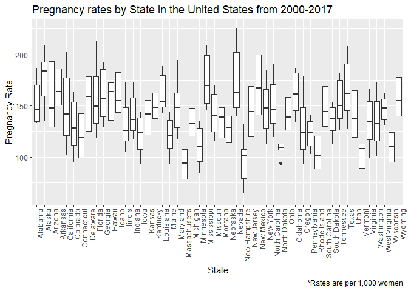
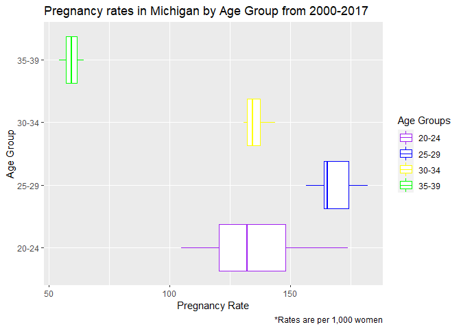
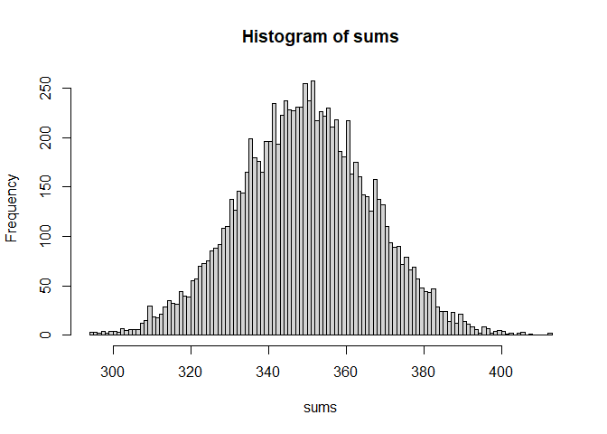

Final Reflection
================
Anna Repesh
12/2/2021

## Final Project

<https://github.com/arepesh/Final-Project>
<https://github.com/arepesh/Final-Project/blob/main/Final%20Project.Rmd>
<https://github.com/arepesh/Final-Project/tree/main/apps>

Bella and I have been working on this project together. The first link
will bring you to the main GitHub page of the project. The second link
brings you to the Rmd file that has everything for the graphs and charts
make to display trends in the data. The third link brings you to the
main page with the different apps that were made. The Shiny Final
Project script file was the one that was shown in class and for some
reason now decided that it doesn’t want to work, and I am not sure what
change from showing it in class. The second script file names Shiny App
that works the best is a map of just the year 2000 for all the states.
You can select different age groups which is what I was most excited
for, and the labels show correctly as well. This app is the one I will
be continuing to work on to figure out exactly how to make the app work.
Finally, the Data Table script you can select age group and year and it
will display in the data table but I change some things and now the
state won’t show up so that is interesting. Overall, I am proud of this
project. Everything might not work exactly how I want it to, but I
pushed myself and I am amazed at how much I have been able to learn. I
do plan to keep working on this to get everything to work in the future.

## Reflection Letter

For most of this refection I will be using the same data set that is
being used in the final project. At this point I have done the most work
with this data and I feel the most confident about what I am able to
accomplish with this data.

-   Import, manage, and clean data

Importing data has been one of the easiest and hardest things to do in
this class. For a normal csv file, I have had no problems getting data
loaded into R but when it comes to any other file it has been a
challenge. For the final project I needed to get a shape file so I could
map the states onto a leaflet map which came in a zip file. It honestly
took me an hour to figure out how to get the zip file loaded and opened.
I did a lot of Goggling and the only I could get it to open was to use
the file.choose command originally. I then found the shapefile command
in the raster package and was able to use the here::here command in
order to get the file to open more efficiently with less steps. I have
included the files in the Repo so that it can be downloaded and chosen
as well. I feel like I have met the importing data section because I
have figured out how to load in more than one type of files.

``` r
birth <- read_csv("NationalAndStatePregnancy_PublicUse.csv")
```

    ## Rows: 912 Columns: 103

    ## -- Column specification --------------------------------------------------------
    ## Delimiter: ","
    ## chr   (3): state, notes, versiondate
    ## dbl (100): year, pregnancyratelt15, pregnancyrate1517, pregnancyrate1819, pr...

    ## 
    ## i Use `spec()` to retrieve the full column specification for this data.
    ## i Specify the column types or set `show_col_types = FALSE` to quiet this message.

``` r
state <- shapefile(here::here("cb_2019_us_state_5m/cb_2019_us_state_5m.shp"))
```

Managing and cleaning data I tend to like to do together because I think
it looks nicer that way, I’m a little OCD so I like to have just the
information I will be using to do something in the data I am working
with. However, I like to keep how I have changed data stored under
different names because then if I need to go back to the original data I
can with no hassle. So, for this data set there were 103 variables and
we only needed 6 of them. So, I went created a second data set named
birth2 because it was from the original birth data, but it was the
second version of this. This way I need to get information from the
first data set I can still go back to it. We also only wanted a select
number of years because we weren’t not interested in the years before
2000. So, all in one I was able to select the data that I wanted and
filter it to show me only the years I want as well. Another reason I do
this is because I don’t like writing extra steps when making graphs of
charts because that is a lot of writing the same code repeatedly and I
lazy sometimes. It is much easier to have a data set already created
with the information I want. Something else that was done to help make
the data easier to work with was pivot the data so that we had all the
age groups in one column and the pregnancy rate in another. This make it
easier when making graphs when grouping was needed.

``` r
birth2 <- birth %>%
  dplyr::select("state", "year", "pregnancyrate2024" : "pregnancyrate3539") %>%
  filter(year >= 2000, state != "US" & state != "DC") 

Pivot_Birth <- birth2 %>%
  pivot_longer(!state:year, names_to = "Group", values_to = "Rate")

merged_birth <- merge(birth2, state, by.x = 'state', by.y = 'STUSPS', all.x = FALSE, duplicateGeom = TRUE)

merged_pivotbirth <- merge(Pivot_Birth, state, by.x = "state", by.y = "STUSPS", all.x = FALSE, duplicateGeom = TRUE)
```

-   Creating graphical displays and numerical summaries of data for
    exploratory analysis and presentations

For this objective I once again used the data from the final project to
do some exploratory analysis and graphical displays. First, I took the
merged_birth data set to find the mean, median, min, and max values for
every state. I used the merged_birth data set because I can’t always
remember the abbreviations for all the states and by merging the birth2
data set with the state data set I am able to get the state names
without having to manually enter them. Now this analysis was a little
overwhelming because it is hard to sift through 50 different states to
see which state has the highest average. Plus, I am a visual person and
looking through giant data sets means nothing to me. I forget numbers or
get distracted. So, I decided to make a box plot that shows all 50
states. Now normally I would have like to put the states variable on the
y axis because the labels are easier to read. However, when I did that,
it made the box plots almost overlap and it really didn’t look super
clean. So, I put the states on the x axis and rotated them so that they
could be read easier. I would have added colors, but I knew with all the
variables some of the colors would start to blend so I decided to leave
that off. I also added more descriptive titles to this box plot, so you
know what you are looking at as soon as you see the graph. I also wanted
to look specifically at Michigan because why not it’s my home state and
I thought it would be interesting to see how the different age groups
compare. To make this box plot I used the merged version of the
Pivot_Birth data set again so that I could use names instead of
abbreviations. I then made a box plot comparing the different age groups
and this time I colored them because I honestly just like colorful they
are it makes it more fun to look at. I also chose to color and not fill
because the fill didn’t look as nice in my opinion. When I made the box
the labels on the y axis were not my favorite “pregnancyrate2024” is
just too long and doesn’t look nice. So, I changed each of the group
labels to their perspective age group so “20-24” for their age group and
so on. Then because I changed the y axis age group labels, I also needed
to change the legend on the side because they didn’t match the y axis
labels so I changed those to match the age group labels and I then chose
specific colors for each of the age groups. Finally, I added labels that
were more descriptive to this box plot. I believe this more accuracy
shows what I have learned to meet this learning objective.

``` r
merged_birth %>%
  dplyr::select("NAME", "year", "pregnancyrate2024") %>%
  group_by(NAME) %>%
  summarise(average_rate = mean(pregnancyrate2024), 
            median_rate = median(pregnancyrate2024),
            min_rate = min(pregnancyrate2024),
            max_rate = max(pregnancyrate2024))
```

    ## # A tibble: 50 x 5
    ##    NAME        average_rate median_rate min_rate max_rate
    ##    <chr>              <dbl>       <dbl>    <dbl>    <dbl>
    ##  1 Alabama             152.        146.    133.      187.
    ##  2 Alaska              176.        184.    135       209.
    ##  3 Arizona             158.        147.    115.      204 
    ##  4 Arkansas            169.        164.    143.      196.
    ##  5 California          147.        142.    102.      203.
    ##  6 Colorado            130.        128.     94.7     163.
    ##  7 Connecticut         118.        119      76.7     147.
    ##  8 Delaware            156.        159.    116.      202.
    ##  9 Florida             155.        150.    119.      214.
    ## 10 Georgia             161.        157.    129.      193.
    ## # ... with 40 more rows

``` r
merged_birth %>%
  ggplot(aes(y = pregnancyrate2024, x = NAME)) +
  geom_boxplot(las = 2) + 
  theme(axis.text.x = element_text(angle = 90, hjust = 1)) +
  labs(x = "State",
       y= "Pregnancy Rate",
       title = "Pregnancy rates by State in the United States from 2000-2017",
       caption = "*Rates are per 1,000 women")
```

    ## Warning: Ignoring unknown parameters: las

<!-- -->

``` r
merged_pivotbirth %>%
  dplyr::select(NAME, Group, Rate) %>%
  filter(NAME == "Michigan") %>%
  ggplot(aes(x = Rate, y = Group, color = Group)) +
  geom_boxplot() +
  scale_y_discrete(labels=c("pregnancyrate2024" = "20-24", 
                            "pregnancyrate2529" = "25-29",
                            "pregnancyrate3034" = "30-34",
                            "pregnancyrate3539" = "35-39")) +
  scale_color_manual(labels = c("20-24", "25-29", "30-34", "35-39"), values = c("purple","blue", "yellow", "green")) +
  guides(color=guide_legend("Age Groups")) +
  labs(x = "Pregnancy Rate",
       y= "Age Group",
       title = "Pregnancy rates in Michigan by Age Group from 2000-2017",
       caption = "*Rates are per 1,000 women")
```

<!-- -->

-   Writing R programs for simulation from probability models and
    randomization-based experiments

For this learning objective I chose to write a function that would roll
a die however many times you wanted it to. I did this because I have
heard of other people using this in experiments, but I have never
actually done it myself and R can roll a die fast than I ever will which
could be helpful in the future. In this I chose to just have it roll 100
times for each of the examples, but it can be changed to whatever number
is desired. I then summed the rolls so I could see how what number the
rolls tended to be around. I then put this function into a for loop so
that I could have this repeated 10000 times and get the sums for each
for loop. I then took these numbers and put them in a histogram so that
I could see if the rolls were normally distributed or not (they should
be normally distributed if the die is fair which it should be in this
experiment). I did find that we had a normal distribution of the sums of
the rolls. The sum of rolls looked to be centered around 350 which was
interesting. So, with the center being around 350 I wanted to see what
the likely hood of the sums of the 100 rolls were of being less than 300
and greater than 400. So, I found all the rolls that were less than 300
and counted how many were less than 300 which in this case was 17. So,
there is a 0.17% chance of the 100 rolls being less than 300. I repeated
this to find the sum of the rolls being greater than 400. For this
experiment there were 14 rolls greater than 400 so the probability of
the sum of the 100 rolls being greater than 400 is 0.14%. I found this
little experiment to be interesting and would like to learn more complex
experiments in the future.

``` r
#getting dice to roll 100 times
sample(1:6, 100, replace = TRUE)
```

    ##   [1] 6 4 5 1 2 2 2 2 3 2 6 6 3 3 3 6 6 3 1 1 1 1 6 5 5 4 1 1 4 3 4 2 2 3 3 5 3
    ##  [38] 3 2 3 3 6 5 2 5 6 1 4 2 3 5 4 1 5 2 5 3 5 5 4 1 3 3 4 3 5 5 5 3 3 1 4 2 2
    ##  [75] 2 2 3 6 1 2 3 2 2 5 2 4 2 3 4 6 6 1 1 3 3 4 6 3 1 1

``` r
#function so I can choose how many times the dice rolls
rolldie = function(n) sample(1:6, n, replace = TRUE)
rolldie(100)
```

    ##   [1] 2 5 3 6 3 1 6 3 3 2 3 4 6 3 2 4 2 4 2 1 3 2 1 3 6 3 6 5 1 3 3 6 5 1 2 2 5
    ##  [38] 5 4 3 2 4 3 4 2 2 3 6 3 2 5 4 1 4 6 2 3 1 3 3 2 4 4 5 2 4 3 3 5 2 4 1 3 5
    ##  [75] 3 2 2 3 4 4 4 4 2 4 4 1 2 3 4 1 1 4 4 2 1 4 4 5 6 3

``` r
#get the sum of the rolls
sum(rolldie(100))
```

    ## [1] 344

``` r
#for loop to roll the die 10000 times
sums = numeric()

for (i in 1:10000) {
  sums = c(sums, sum(rolldie(100)))
}
sums[1:40]
```

    ##  [1] 346 367 330 348 369 332 391 336 364 323 344 318 365 346 353 345 331 370 321
    ## [20] 372 349 341 331 331 343 339 343 371 358 382 328 341 340 358 347 364 317 368
    ## [39] 331 354

``` r
#making a histogram of the sums of the 1000 rolls
hist(sums, breaks = 100)
```

<!-- -->

``` r
#finding probability of the sums being less than 300
sums[sums < 300]
```

    ##  [1] 295 297 297 297 298 299 291 296 299 297 294 294 296 293 296 297 299

``` r
length(sums[sums < 300])
```

    ## [1] 17

``` r
17/10000
```

    ## [1] 0.0017

``` r
#finding probability of the sums being greater than 400
sums[sums > 400]
```

    ## [1] 406 402 404 404 405 403 403

``` r
length(sums[sums > 400])
```

    ## [1] 7

``` r
14/10000
```

    ## [1] 0.0014

-   Using source documentation and other resourced to troubleshoot and
    extend R programs.

Google has been my best friend in this class. Expectantly throughout the
final project. While going thought the process of trying to use leaflet
and shiny I have learned a lot from the Shiny app gallery and other
people on the internet that have gotten the same errors as I have. That
is the one nice thing about R is most likely someone has run into the
same problems that you have. I have used a bunch of different discussion
board pages where people have put in their code to see if someone else
would be able to look at it and find the mistake. A lot of the time I
have the same exact error they do and can look in the comments to see
what others have suggested to fix the error. It is super rare that no
one has tried what you are doing before. So, I am very grateful for
everyone that has struggled before me so that I can learn from their
mistakes as well. I also feel that getting errors also helps to get a
better understanding of how code should be written. I have extended my
knowledge of R extensively while trouble shooting and now have a much
better understanding of what needs to be included in specific commands
for them to run more smoothly.

-   Write clear, efficient, and well-documented R programs

<https://github.com/arepesh/Final-Project/blob/main/Map%20for%20one%20year%20and%20age%20group.R>

For writing clear, efficient, and well-documented R programs I have add
the link above that goes to an R Script for a part of the project that I
was able to have working completely exactly how I wanted it to. To write
this I had followed step by step with another person’s project to figure
out what each step did. After getting theirs to work fully I moved on to
writing my own version of it with my data. The original version of this
was very messy and there was a lot of code that still didn’t work or was
unnecessary for my project. So, this final version is the clean code
that only contains what I did and what was needed. I was also proud of
myself for adding comments about what each part did. I am not the best
at this a future me hates past me for it because then I have to take
time going back through the code to figure out what in the world I was
doing. I think this is the best example for this objective because it is
the cleanest and works fully.

## Grade and Other Thoughts

I would give myself and A in this class. If I look back to what I was
able to do at the beginning of the semester vs now I am amazed at what I
have accomplished. I am much more confident in what I can do in R now vs
the beginning of the semester. I also really appreciate the fact that we
have been given room to fail in this class. Knowing that I haven’t been
solely focused on getting a specific grade I know I have pushed myself
to try and make the shiny app. I know I would have never tried to take
on such a task if I was so focused on the grade and by pushing myself, I
have expanded my knowledge so much more. Even though I have yet to get
my Shiny app working exactly how I want to I am still proud of the
progress that I did make. I do plan to keep working through the bugs to
get the app working exactly how I want to so that I can publish it on
Shiny so hopefully that can be there in the future. I also do have plans
for other things I would like to try. I am excited to continue using R
in the future whether it is through work or just for my own enjoyment.
